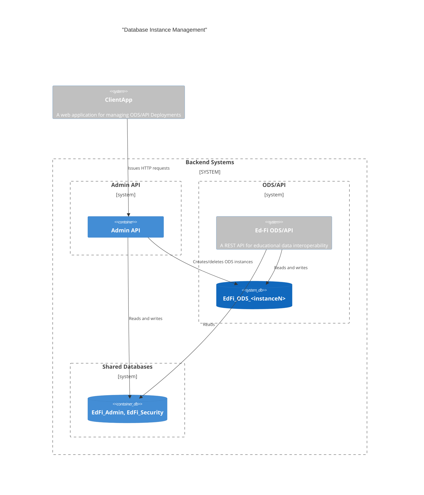
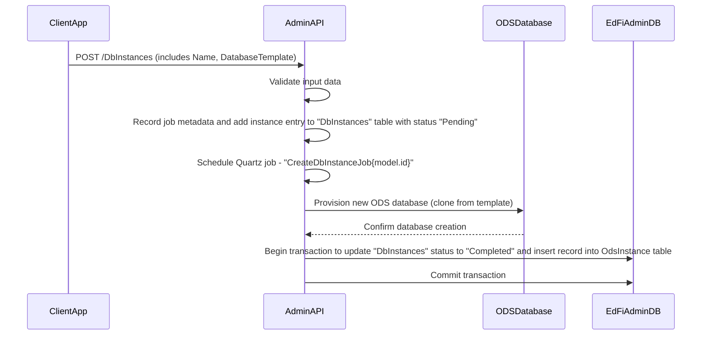
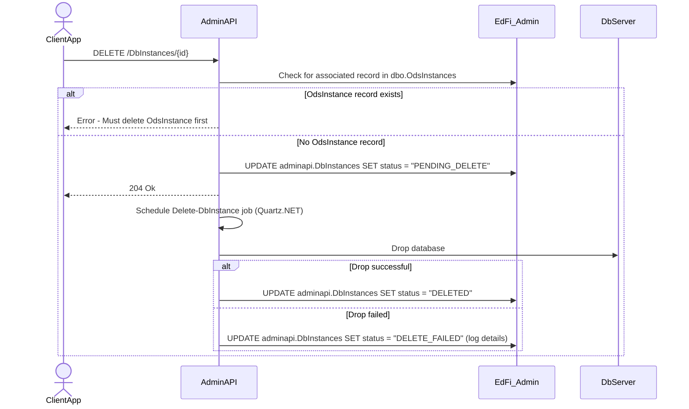

# Ed-Fi ODS Instance Management Design

This document describes the design and workflow for managing Ed-Fi ODS database
instances using the Admin API. All orchestration, job scheduling, and status
updates are handled by the Admin API, leveraging Quartz.NET for asynchronous
operations.

## API Endpoints Overview

Database instance management operations are performed on the
`adminapi.DbInstances` endpoint for direct database management (create, delete).

## System Architecture



## Configuration

Two sets of database credentials are required for instance management
operations:

* **Regular DDL Credentials:** Used for standard data definition language (DDL)
  operations across all managed databases.
* **Admin Credentials:** Used for connecting to the `master` database. These
  credentials are required for all database management operations, such as
  creating or dropping databases.

This separation ensures that routine operations and sensitive management tasks
are handled securely and with appropriate permissions.

## Database table structure

```sql
CREATE TABLE [adminapi].[DbInstances] (
    [Id] INT IDENTITY(1,1) NOT NULL,
    [Name] NVARCHAR(100) NOT NULL,
    [OdsInstanceId] INT NOT NULL,
    [OdsInstanceName] NVARCHAR(100) NOT NULL, 
    [Status] NVARCHAR(75) NOT NULL,
    [DatabaseTemplate] NVARCHAR(100) NOT NULL,
    [DatabaseName] NVARCHAR(255) NULL,
    [LastRefreshed] DATETIME2 NOT NULL DEFAULT GETUTCDATE(),
    [LastModifiedDate] DATETIME2 NULL,
    CONSTRAINT [PK_DbInstances] PRIMARY KEY ([Id])
)
```

All operations update the `Status` field in `adminapi.DbInstances` to reflect
the current state (e.g., "Pending", "Completed", "InProgress", "Pending_Delete",
"Deleted", "Delete_Failed", "Error").

## DbInstances Endpoint Operations

The `DbInstances` endpoint supports the following operations:

* **Create Database Instance**: Provision a new ODS database instance. This
  operation creates a new record in `adminapi.DbInstances` and provisions the
  database using the specified template (minimal or populated/ sample).

```http
POST /v3/DbInstances
Authorization: Bearer <token>
{
  "name": "Database instance",
  "databaseTemplate": "minimal"
}
```

### Creating DbInstance

`POST /DbInstances` creates a new entry in the `adminapi.DbInstances` table with
a status of "Pending". This action triggers the "Create-DbInstance-{InstanceId}"
job, which runs immediately or is queued according to the configured schedule.
When the job starts, the status is updated to "InProgress". If the database
creation fails, the status changes to "Failed" and the failure details are
logged. On successful completion, the status is set to "Completed". After a
successful job, a new record is added to the `dbo.OdsInstances` table with the
generated connection string.



### Creating OdsInstance

`POST /OdsInstances` creates a new entry in the `dbo.OdsInstances` table and
also adds a corresponding record to the `adminapi.DbInstances` table with:

* `OdsInstanceId`
* `OdsInstanceName`
* `DatabaseName` (from the connection string)
* Status set to "Completed"

Note: This operation does **not** initiate database creation.

> [!TIP]
> Admin API 2 on startup queries the `dbo.OdsInstances` table used by the
> ODS/API and inserts missing records into the `adminapi.DbInstances` with
> `Completed` status. This solves a potential synchronization problem between
> these two tables.

* **Delete Database Instance**: Remove an existing database instance. This is a
  soft delete; the `Status` field in `adminapi.DbInstances` is set to "DELETED"
  for audit purposes, and the database is dropped.

```http
DELETE /v3/DbInstances/{Id}
Authorization: Bearer <token>

```

### Deleting DbInstance

Deleting a `DbInstance` will remove the associated database only if there is no
corresponding record in the `dbo.OdsInstances` table. To delete the database,
first delete the record from `dbo.OdsInstances`, then send a delete request to
the `/DbInstances` endpoint. If no associated record exists in
`dbo.OdsInstances`, the delete request will trigger the
`Delete-DbInstance-{InstanceId}` job, updating the DbInstance status to
"Pending-Delete". Upon successful database deletion, the status will be set to
`Deleted`. If the deletion fails, the status will be updated to `Delete-Failed`
and failure details will be logged.

### Deleting OdsInstance

Deleting an OdsInstance removes the record from the `dbo.OdsInstances` table and
sets the corresponding `adminapi.DbInstances` record to "Orphaned" status. To
completely remove both the OdsInstance and its database, first delete the record
from `dbo.OdsInstances`, then send a delete request to `adminapi.DbInstances`.

>[!NOTE]
> If the database does not exist on the data server, the delete request will
> return "not found".



### Read DbInstances

* **Read all database Instances**: Read instances with details (OdsInstanceId,
  OdsInstanceName, Status, DatabaseTemplate etc..).
  
* **Read database Instance by OdsInstance Id**: Read Instance details by
  OdsInstance id.
