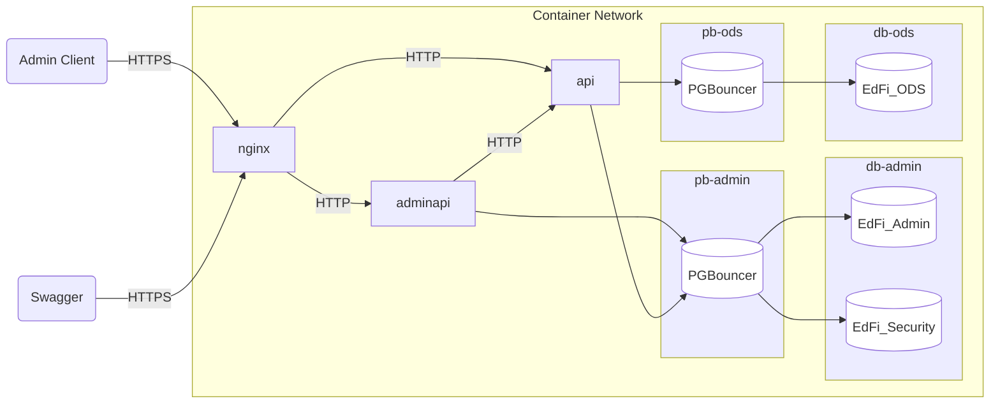
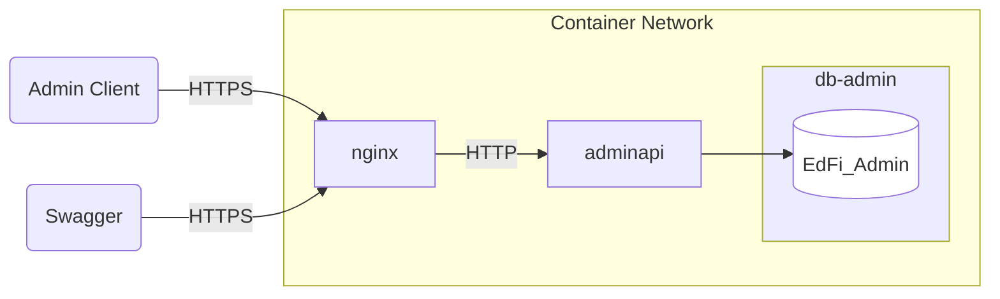

# Docker Support for AdminAPI

Must already have Docker Desktop or equivalent running on your workstation.

## Quick Start for Local Development and Testing

PostgreSQL



1. From a Bash prompt, generate a dev/test self-signed certificate for TLS
   security. This will create `server.crt` and `server.key` in the `ssl`
   directory:

   ```bash
   cd Docker/Settings/ssl
   bash ./generate-certificate.sh
   ```

2. Copy and customize the `.env.example` file. The project has a PostgreSQL
   version (Docker/Compose/pgsql) and a MSSQL version (Docker/Compose/mssql)
   to run the containers. Importantly, be sure to change the encryption key.
   In a Bash prompt, generate a random key thusly: `openssl
   rand -base64 32`.

   PostgreSQL

   ```shell
   cd Docker/Compose/pgsql
   cp .env.example .env
   code .env
   ```

   MSSQL

   ```shell
   cd Docker/Compose/mssql
   cp .env.example .env
   code .env
   ```

   > [!NOTE]
   > The .env file is a shared resource that can be referenced by both the
   > "MultiTenant" and "SingleTenant" compose files.

3. Build local containers (optional step; next step will run the build implicitly)

   ```shell
   docker compose -f SingleTenant/compose-build-dev.yml build
   ```

4. Start containers

   ```shell
   docker compose -f SingleTenant/compose-build-dev.yml up -d
   ```

5. Inspect containers

   ```shell
   # List processes
   docker compose -f SingleTenant/compose-build-dev.yml ps

   # Check status of the AdminAPI
   curl -k https://localhost/adminapi

   ```

6. Create an administrative (full access) API client (substitute in appropriate
   values for `ClientId`, `ClientSecret`, and `DisplayName`)

   Bash

   ```bash
   curl -k -X POST https://localhost/adminapi/connect/register \
    -H "Content-Type: application/x-www-form-urlencoded" \
    -d "ClientId=YourClientId&ClientSecret=YourClientSecret&DisplayName=YourDisplayName"
   ```

   PowerShell

   ```powershell
   curl -k -X POST https://localhost/adminapi/connect/register `
    -H "Content-Type: application/x-www-form-urlencoded" `
    -d "ClientId=YourClientId&ClientSecret=YourClientSecret&DisplayName=YourDisplayName"
   ```

   :exclamation: Disable new client registration in `appsettings.json` and
   restart the containers.

7. Try using [Swagger UI](https://localhost/adminapi/swagger/index.html) to test
   out the AdminApi.
8. Stop containers

   ```shell
   docker compose -f compose-build-dev.yml down
   ```

## Testing Pre-Built Binaries

This configuration is not intended for live testing or production environments;
its only intention is to simplify installation and testing of Admin API code
that has been bundled into NuGet Packages through the normal development
process, and published to Ed-Fi's Azure Artifacts registry. Note that this
version does not include PGBouncer, though it does preserve NGiNX, and it does
not start the ODS/API.



Instructions are similar to the localhost quickstart above, except use
`compose-build-binaries.yml`, `compose-build-idp-binaries.yml` or `compose-build-idp-dev.yml` instead of `compose-build-dev.yml`.

## Multi-Tenant

Instructions are similar to the Local Development and Pre-Built Binaries setups above.

Tenants details can be configured on appsettings.dockertemplate.json file.

For local development and testing, use `MultiTenant/compose-build-dev-multi-tenant.yml`.
For local development and testing with keycloak, use `MultiTenant/compose-build-idp-dev-multi-tenant.yml`.
For testing pre-built binaries, use `MultiTenant/compose-build-binaries-multi-tenant.yml`.
For testing pre-built binaries with keycloak, use `MultiTenant/compose-build-idp-binaries-multi-tenant.yml`.

## Admin Api and Ed-Fi ODS / API docker containers

Please refer [DOCKER DEPLOYMENT](https://techdocs.ed-fi.org/display/EDFITOOLS/Docker+Deployment) for
installing and configuring Admin Api along with Ed-Fi ODS / API on Docker containers for testing.

## ODS Database Restore from Backup Files

 By default, the **MSSQL** `db-ods` image downloads and uses the Ed-Fi minimal template from NuGet at build time.
 For **PostgreSQL**, the custom `db-ods` image restores template databases from bind-mounted backup files instead.

### How It Works

* **MSSQL**: The container accepts `.bak` backup files. The bind mount exposes your host folder
  inside the container as read-only, and the init script restores from those files on first startup.
* **PostgreSQL**: The container accepts plain-SQL (`.sql`) dump files. A custom image
  (`Docker/Settings/shared/DB-Ods/pgsql/`) initializes the PostgreSQL data directory and restores
  both the minimal and populated template databases on first startup.

In both cases, restoration only runs when the data directory is empty (i.e., on a fresh volume).
Subsequent container restarts reuse the already-restored data.

### Required Environment Variables

Set the following variables in your `.env` file (see `env.example` for reference):

| Variable | Description |
|---|---|
| `SQL_BACKUPS_FOLDER` | **Required.** Absolute path on the **host** to the folder containing the backup files. |
 | `MINIMAL_BAK_PATH` / `MINIMAL_SQL_PATH` | Path to the minimal template backup **inside the container**. Defaults to `/var/opt/mssql/data/sql-backups/EdFi.Ods.Minimal.Template.bak` (MSSQL) or `/sql-backups/EdFi.Ods.Minimal.Template.sql` (PostgreSQL). |
 | `POPULATED_BAK_PATH` / `POPULATED_SQL_PATH` | Path to the populated template backup **inside the container**. Defaults to `/var/opt/mssql/data/sql-backups/EdFi.Ods.Populated.Template.bak` (MSSQL) or `/sql-backups/EdFi.Ods.Populated.Template.sql` (PostgreSQL). |

### Example `.env` Configuration

MSSQL

```env
SQL_BACKUPS_FOLDER=C:/path/to/your/backups
MINIMAL_BAK_PATH=/var/opt/mssql/data/sql-backups/EdFi.Ods.Minimal.Template.bak
POPULATED_BAK_PATH=/var/opt/mssql/data/sql-backups/EdFi.Ods.Populated.Template.bak
```

PostgreSQL

```env
SQL_BACKUPS_FOLDER=/path/to/your/backups
MINIMAL_SQL_PATH=/sql-backups/EdFi.Ods.Minimal.Template.sql
POPULATED_SQL_PATH=/sql-backups/EdFi.Ods.Populated.Template.sql
```

> [!NOTE]
> The `SQL_BACKUPS_FOLDER` is mounted into the container as read-only at `/sql-backups/` (PostgreSQL)
> or `/var/opt/mssql/data/sql-backups/` (MSSQL). The `MINIMAL_*_PATH` and `POPULATED_*_PATH`
> variables must point to files within that mounted path inside the container.

> [!IMPORTANT]
> If `SQL_BACKUPS_FOLDER` is not set, or the backup files are not found at the specified paths,
> the container will exit immediately with a descriptive error message.
